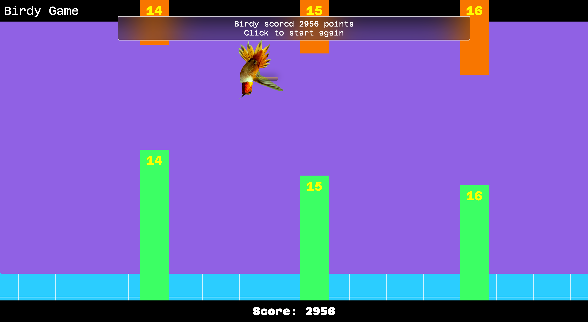

# Birdy Game

Birdy Game is browser-based arcade game making reference to Flappy Bird. Control a hummingbird as it navigates through a series of moving pipes, aiming to achieve the highest score possible. This version highlights the game’s logic, offers a lightweight yet engaging experience with a retro aesthetic, and proudly showcases its library-free construction, appealing to developers who appreciate lean, self-contained projects.

## License

This project is licensed under the MIT License - see the [LICENSE](LICENSE) file for details.

## Visuals

## Contact

Maintained by tpreisig - feel free to reach out!
